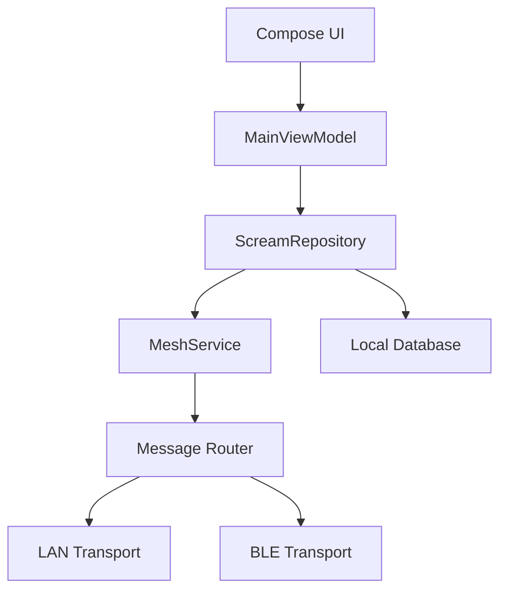

# SCREAM Project Plan

## Vision

SCREAM is an offline-first civilian resilience communication app for internet
outages, wildfire response, remote field work, transport interruptions, and
other situations where normal infrastructure is unavailable or unreliable.

The promise is simple: open the app, see people nearby, create or join rooms, chat, and share useful data without needing the internet.

## Scale Target

SCREAM should scale by growth of the network, not by making every phone connect directly to every other phone.

Direct phone-to-phone links are local and limited by Bluetooth/Wi‑Fi hardware, battery, operating-system limits, and radio range. A single device cannot maintain live connections to millions or billions of devices. The powerful design is a mesh:

- Each device connects to nearby peers only.
- Messages use IDs so duplicates are ignored.
- Messages use TTL/hop limits so they do not loop forever.
- Devices forward safe message types to expand reach.
- Large networks form from many small nearby clusters.
- Future internet gateways can bridge clusters when available.

This lets the app grow with the number of users while staying realistic and working on actual phones.

## Positioning

SCREAM should feel more approachable than a technical mesh messenger:

- Friendly language instead of network jargon.
- Clear nearby-user discovery.
- Simple room and private chat flows.
- Visible connection status.
- Safe defaults for identity and privacy.
- The UI distinguishes verified facts from estimates: RSSI is not distance, a
  discovered device is not a trusted identity, and encryption status is not
  proof of sender authenticity.
- Security claims must name their boundary and never use unsupported terms
  such as “military-grade” or “unbreakable.”

## Future story capsules

Stories are a future feature, not part of the current secure transport. The
intended design is a horizontal, capsule-shaped strip inspired by the supplied
references, with a clear “You” create action and peer capsules showing only
the public avatar/emoji by default. Each story must have an explicit audience,
short expiry, propagation budget, deduplication ID, authenticated encrypted
media, visible queued/relayed/expired states, and a user-controlled delete
action. The UI should use restrained motion, high contrast, large touch targets,
and no autoplay when offline or on metered power.

## Current State

Implemented:

- Profile onboarding.
- Public feed.
- Rooms.
- Private chat room creation.
- Nearby peer list in app state.
- LAN-based discovery using UDP heartbeats.
- LAN-based message transport using TCP sockets.
- Message IDs for network payloads.
- Duplicate-message filtering.
- TTL-based message forwarding across known peers.
- Remote room IDs and chat message IDs preserved.

Not yet implemented:

- True Bluetooth/BLE discovery.
- Bluetooth/BLE data transfer.
- File/document sharing.
- Message persistence.
- Delivery acknowledgements.
- End-to-end encryption.
- Runtime permission UX for Android 12+ Bluetooth permissions.
- Production-grade multi-hop routing.

## Milestone 1 — Stabilize Current LAN Mesh

Goal: make the existing peer-to-peer system reliable before adding Bluetooth.

Tasks:

- Add a transport interface so LAN and Bluetooth can share the same app logic.
- Add stronger payload validation and malformed-message rejection.
- Add basic connection status: scanning, connected peers, last seen.
- Add runtime permission prompts for nearby/network features.

Done when:

- Two Android devices on the same Wi‑Fi can discover each other.
- Messages appear once, in the correct room.
- Created rooms are shared with matching IDs across devices.
- The UI clearly shows whether nearby discovery is active.

## Milestone 2 — Real Nearby Discovery

Goal: detect nearby SCREAM users even without shared Wi‑Fi.

Recommended approach:

- Use BLE advertising for lightweight identity beacons.
- Use BLE scanning to discover nearby users.
- Keep advertised data minimal: app marker, public peer ID, alias hash or short alias, capabilities.
- Do not advertise age/gender by default.

Tasks:

- Create `NearbyTransport` abstraction.
- Implement `LanTransport` from the current UDP/TCP engine.
- Add `BleDiscoveryTransport` for scan/advertise.
- Build a Nearby Users screen/card list.
- Add permission education screens for Bluetooth/location requirements.

Done when:

- Two phones can see each other nearby with Wi‑Fi off.
- Users can tap a discovered peer and start a private room.
- The app explains permissions in plain language.

## Milestone 3 — Offline Messaging Core

Goal: make messaging useful and dependable.

Tasks:

- Persist rooms and messages locally.
- Add message delivery state: sending, sent, received, failed.
- Add retry queue for peers that disappear temporarily.
- Add message TTL to prevent old messages spreading forever.
- Add basic moderation tools: block peer, hide post, report locally.

Done when:

- App restart does not erase chats.
- Failed messages can retry.
- Users can block noisy or abusive nearby peers.

## Milestone 4 — Document/Data Sharing

Goal: allow safe nearby document sharing.

Tasks:

- Add attachment model: file name, size, MIME type, checksum.
- Add file picker for documents/images.
- Chunk files for transfer.
- Add progress UI.
- Verify checksum after receive.
- Require explicit accept before downloading from another peer.
- Store received files in app-private storage first.

Done when:

- A user can send a small PDF/image to a nearby peer.
- Receiver sees sender, file name, size, and accept/decline.
- Completed file transfer verifies successfully.

## Milestone 5 — Mesh Routing

Goal: allow messages to move beyond direct device range.

Tasks:

- Add route envelope: message ID, source, destination, hop count, TTL.
- Maintain seen-message cache.
- Forward only safe message types.
- Prevent routing loops.
- Add room-level broadcast routing.
- Tune battery impact.

Done when:

- Device A can send to Device C through Device B in a controlled test.
- Duplicate messages do not appear.
- Expired messages stop forwarding.

## Technical Architecture Target



Recommended modules/classes:

- `MeshService`: starts/stops discovery and messaging.
- `Transport`: common interface for LAN, BLE, Wi‑Fi Direct, or future transports.
- `MessageEnvelope`: network-safe wrapper for every payload.
- `MessageRouter`: deduplication, TTL, forwarding, and delivery events.
- `LocalStore`: persistent users, rooms, messages, attachments.
- `PermissionManager`: Android runtime permission state and prompts.

## Message Envelope

Every payload should use a common wrapper:

```json
{
  "version": 1,
  "id": "uuid",
  "type": "CHAT_MESSAGE",
  "sourcePeerId": "peer-id",
  "destinationPeerId": "optional-peer-id",
  "roomId": "room-id",
  "timestamp": 1720000000000,
  "ttl": 6,
  "payload": {}
}
```

## Privacy Rules

- Do not broadcast age or gender by default.
- Let users choose a display alias and avatar.
- Keep nearby identity rotatable if possible.
- Ask before receiving files.
- Show who can see a message: public nearby feed, room, or private chat.
- Add block controls before public release.

## Risks

- Android BLE limits vary by device and OS version.
- Bluetooth permissions are confusing without clear onboarding.
- Background scanning can drain battery.
- File transfer over BLE can be slow; consider BLE for discovery and Wi‑Fi Direct/local sockets for larger transfers.
- “Free speech” features still need user safety tools to prevent harassment.

## Immediate Next Tasks

1. Refactor `P2pMeshEngine` into a transport-based design.
2. Add network message IDs and duplicate filtering.
3. Preserve remote room/post/message IDs from payloads.
4. Build a clear Nearby Users UI.
5. Add runtime permission handling for Bluetooth and nearby devices.
6. Add local persistence for messages and rooms.
